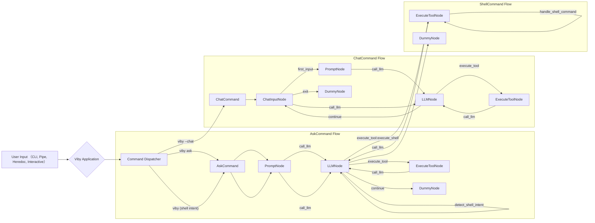
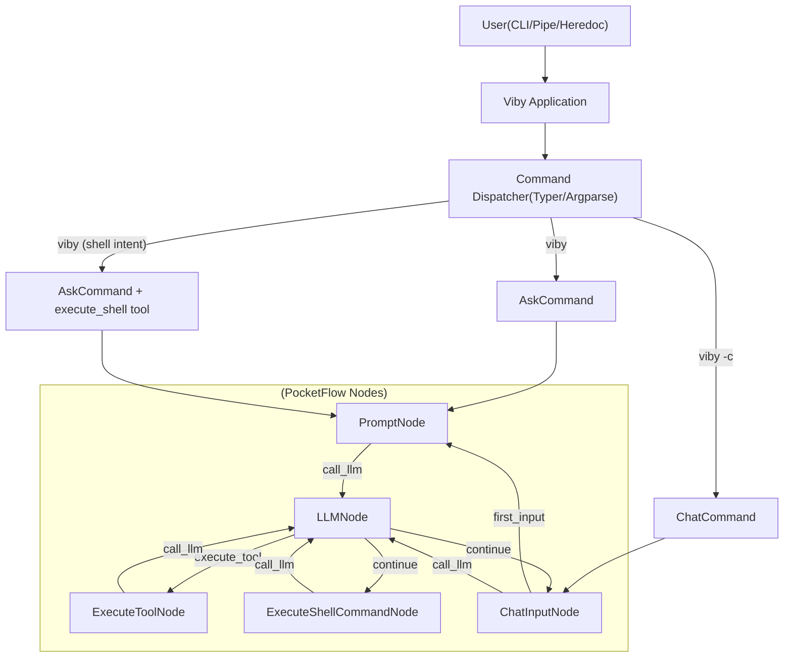
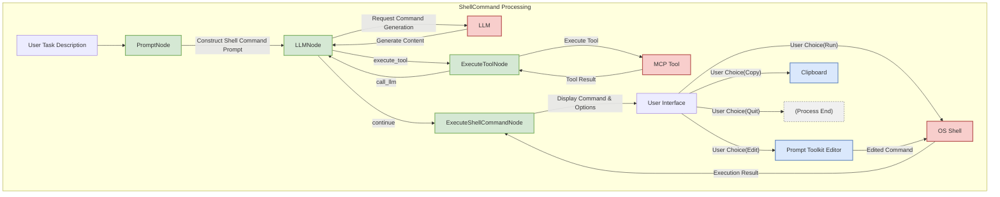

# Viby Project Design Documentation

  
  <h1>Viby</h1>
  
<strong>Viby vibes everything</strong>

## 1. Project Overview

Viby is an innovative command-line tool designed for efficient interaction with large language models (LLMs). It provides a Chinese interface and aims to offer users a convenient and powerful AI assistant that can understand natural language instructions, generate and execute shell commands, handle various input methods, and support interactive conversations.

The core goal of the project is to simplify the interaction process between users and AI models, seamlessly integrating AI capabilities into daily command-line operations to improve work efficiency and intelligence.

## 2. Core Features

Viby provides a series of powerful and practical features, including:

* **Smart Q&A:** Users can directly ask questions to AI and get detailed answers and explanations generated by large language models.
* **Shell Command Generation & Execution:**
  * Intelligently generates corresponding shell commands based on users' natural language descriptions.
  * Provides detailed Chinese explanations for generated commands.
  * Supports flexible command post-processing options:
    * **[r] Run:** Directly execute the generated command.
    * **[e] Edit:** Modify the command using the interactive editor provided by `prompt_toolkit`.
    * **[y] Copy:** Copy the command to clipboard.
    * **[q] Quit:** Cancel the current operation.
* **Multiple Input Methods:**
  * **Pipe Input:** Can receive and process pipe output from other commands (like `git diff`) as input.
  * **Heredoc:** Supports multi-line text input through heredoc syntax, convenient for longer instructions or code blocks.
  * **Command-line Arguments:** Directly pass questions or tasks through command-line arguments.
* **Interactive Chat Mode:**
  * Start with `--chat` or `-c` option, allowing users to have continuous multi-turn conversations with AI.
* **Large Language Model Integration:**
  * Currently mainly integrates [Ollama](https://ollama.com/), facilitating local deployment and use of various open-source large language models. Also supports any LLM service provider compatible with OpenAI API format.
* **Chinese-Friendly:**
  * All interface prompts, output information and documentation are provided in Chinese.

## 3. Project Design & Architecture

Viby adopts the `pocketflow` framework, describing the execution process in graph form, significantly improving code reusability, maintainability and extensibility.

### 3.1. PocketFlow Framework

The introduction of the `pocketflow` framework makes Viby's command processing flow more modular. Each core function is abstracted into one or more independent "Nodes", which can be flexibly combined to form clear data processing pipelines.

### 3.2. Command Structure

Viby's main functions are implemented through the following core command classes:

* **`AskCommand`:**
  * Handles users' direct questions.
  * Receives user input, interacts with LLM, and returns AI-generated answers.
* **`ChatCommand`:**
  * Manages interactive chat mode.
  * Maintains conversation context, supporting multi-turn Q&A.
* **`ShellCommand`:**
  * Handles shell command-related tasks.
  * Includes generating shell commands based on user descriptions, providing command explanations, and subsequent execution, editing and other operations.

### 3.3. Node System

Viby's core logic is implemented through a node-based system, with different types of nodes responsible for specific tasks in the process:

* **`ChatInputNode`:**
  * Responsibility: Gets user input in interactive chat mode and adds it to message history.
* **`PromptNode`:**
  * Responsibility: Processes user input, constructs prompts sent to LLM, and prepares different prompt templates according to command types (ask/chat/shell).
* **`LLMNode`:**
  * Responsibility: Calls large language model to get replies, handles streaming output, and detects tool call requests.
* **`ExecuteToolNode`:**
  * Responsibility: Executes tool call requests from LLM and returns results to LLM for further processing.
* **`ExecuteShellCommandNode`:**
  * Responsibility: Displays generated shell commands, provides user interaction options (run, edit, copy, quit), executes commands and displays results.
* **`DummyNode`:**
  * Responsibility: Serves as the termination point of the flow, performing no actual operations.

### 3.4. Technology Stack

* **Programming Language:** Python
* **Core Framework:** PocketFlow
* **Large Language Model Interface:** Ollama, and any service compatible with OpenAI API format (through ModelManager abstraction layer).

## 4. Workflow

Viby's workflow varies according to the command type and input method called by users, but the core revolves around the "input -> processing -> AI interaction -> output" pattern.

### 4.1. General Process

### 4.2. Shell Command Tool Processing

Shell command processing is now integrated through the MCP tool system and automatically detected when needed:

1. **Intent Detection:** When a user query is about shell commands or system operations, the system automatically detects this intent.
2. **Command Generation (Via LLM):**
   * LLM recognizes the shell command intent and generates appropriate shell commands.
   * Commands are returned with explanations when appropriate.
3. **User Interaction & Selection:**
   * `ExecuteShellCommandNode` displays generated commands to users.
   * Provides operation options: run (`r`), edit (`e`), copy (`y`), quit (`q`).
4. **Subsequent Processing:**
   * **Run:** If user chooses to run, the system executes the command and displays its output or error.
   * **Edit:** If user chooses to edit, the system starts the interactive editor provided by `prompt_toolkit`. After modification, users can choose to run again or quit.
   * **Copy/Quit:** Performs corresponding operations.

### 4.3. `ChatCommand` (Interactive Chat) Process

1. **Start:** User starts interactive chat mode with `-c` or `--chat` option.
2. **Loop Interaction:**
   * `InputNode` waits for and receives each round of user input.
   * `ReplyNode` (optimized for chat mode) maintains conversation history (context), combines current user input with historical conversation, and constructs new prompts to send to Ollama LLM.
   * LLM generates replies based on context.
   * `ReplyNode` displays AI's replies to users.
3. **End:** Users can end conversation with specific commands (like `exit`, `quit`) or `Ctrl+D`.

## 5. Diagrams

### 5.1. Viby High-Level Architecture Diagram

### 5.2. `ShellCommand` Node System Data Flow

---

Version V0.0.0 07 May 2025