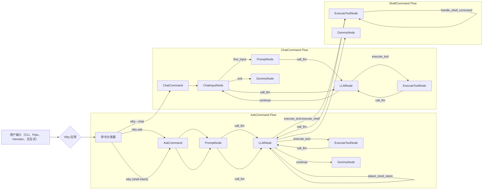
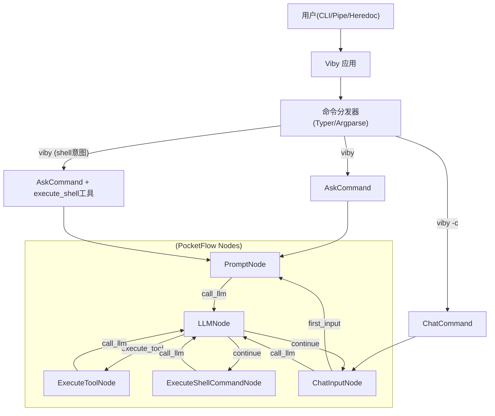
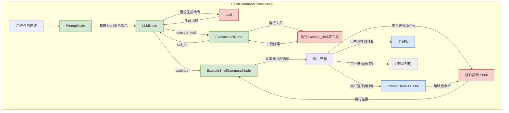

# Viby 项目设计与流程文档

  
  <h1>Viby</h1>
  
<strong>Viby vibes everything</strong>

## 1. 项目概述

Viby 是一个基于命令行的创新工具，专为与大语言模型（LLM）进行高效交互而设计。它提供中文界面，旨在为用户提供一个便捷、强大的 AI 助手，能够理解自然语言指令、生成和执行 Shell 命令、处理各种输入方式，并支持交互式对话。

项目的核心目标是简化用户与 AI 模型的互动过程，将 AI 的能力无缝集成到日常的命令行操作中，提高工作效率和智能化水平。

## 2. 核心功能

Viby 提供了一系列强大且实用的功能，主要包括：

* **智能问答：** 用户可以直接向 AI 提问，获取由大语言模型生成的详细答案和解释。
* **Shell 命令生成与执行：**
  * 根据用户的自然语言描述，智能生成相应的 Shell 命令。
  * 提供对生成命令的详细中文解释。
  * 支持灵活的命令后处理选项：
    * **[r]运行 (Run)：** 直接执行生成的命令。
    * **[e]编辑 (Edit)：** 使用 `prompt_toolkit` 提供的交互式编辑器修改命令。
    * **[y]复制 (Copy)：** 将命令复制到剪贴板。
    * **[q]放弃 (Quit)：** 取消当前操作。
* **多种输入方式：**
  * **管道输入 (Pipe)：** 能够接收和处理来自其他命令（如 `git diff`）的管道输出作为输入。
  * **Heredoc：** 支持通过 heredoc 语法进行多行文本输入，方便输入较长的指令或代码块。
  * **命令行参数：** 直接通过命令行参数传递问题或任务。
* **交互式对话模式：**
  * 通过 `--chat` 或 `-c` 选项启动，允许用户与 AI进行连续的多轮对话。
* **大语言模型集成：**
  * 目前主要集成 [Ollama](https://ollama.com/)，方便本地部署和使用多种开源大语言模型。也支持任何兼容 OpenAI API 格式的 LLM 服务提供商。
* **中文友好：**
  * 所有界面提示、输出信息和文档均提供中文。

## 3. 项目设计与架构

Viby 采用了 `pocketflow` 框架，以图的形式描述执行过程，显著提升了代码的复用性、可维护性和可扩展性。

### 3.1. PocketFlow 框架

`pocketflow` 框架的引入使得 Viby 的命令处理流程更加模块化。每个核心功能被抽象为一个或多个独立的“节点”（Node），这些节点可以灵活组合，形成清晰的数据处理流水线。

### 3.2. 命令结构 (Command Structure)

Viby 的主要功能通过以下几个核心命令类实现：

* **`AskCommand`**:
  * 负责处理用户的直接提问。
  * 接收用户输入，与 LLM 交互，并返回 AI 生成的答案。
* **`ChatCommand`**:
  * 负责管理交互式对话模式。
  * 维护对话上下文，支持多轮问答。
* **`ShellCommand`**:
  * 负责处理与 Shell 命令相关的任务。
  * 包括根据用户描述生成 Shell 命令、提供命令解释、以及后续的执行、编辑等操作。

### 3.3. 节点系统 (Node System)

Viby 的核心逻辑通过一个基于节点的系统实现，不同类型的节点负责处理流程中的特定任务：

* **`ChatInputNode`**:
  * 职责：在交互式对话模式中获取用户输入，并将其添加到消息历史中。
* **`PromptNode`**:
  * 职责：处理用户输入，构建发送给 LLM 的提示（prompt），并根据命令类型（ask/chat/shell）准备不同的提示模板。
* **`LLMNode`**:
  * 职责：调用大语言模型获取回复，处理流式输出，并检测是否有工具调用请求。
* **`ExecuteToolNode`**:
  * 职责：执行来自 LLM 的工具调用请求，并将结果返回给 LLM 继续处理。
* **`ExecuteShellCommandNode`**:
  * 职责：显示生成的 Shell 命令，提供用户交互选项（运行、编辑、复制、放弃），执行命令并显示结果。
* **`DummyNode`**:
  * 职责：作为流程的终止点，不执行任何实际操作。

### 3.4. 技术栈 (Technology Stack)

* **编程语言：** Python
* **核心框架：** PocketFlow
* **大语言模型接口：** Ollama, 以及任何兼容 OpenAI API 格式的服务（通过 ModelManager 抽象层）。

## 4. 工作流程 (Workflow)

Viby 的工作流程根据用户调用的命令类型和输入方式有所不同，但核心都围绕着“输入 -> 处理 -> AI 交互 -> 输出”的模式。

### 4.1. 通用流程

### 4.2. Shell命令工具处理流程

Shell命令处理是 Viby 的核心功能之一，现在通过工具调用机制实现：

1. **输入处理**: LLM接收用户用自然语言描述的任务（例如："列出当前目录下所有的 Python 文件"）。
2. **意图检测**:
    * LLM识别用户意图为获取Shell命令。
    * LLM自动选择调用`execute_shell`工具，生成相应的Shell命令。
3. **工具调用**:
    * `ExecuteToolNode`接收到工具调用请求，处理参数并调用`handle_shell_command`函数。
    * 系统展示生成的命令并提供操作选项：运行 (`r`), 编辑 (`e`), 复制 (`y`), 放弃 (`q`)。
4. **用户交互与执行**:
    * **运行**: 如果用户选择运行，系统会执行该命令，并显示其输出或错误。
    * **编辑**: 如果用户选择编辑，系统会启动`prompt_toolkit`提供的交互式编辑器，用户修改完毕后，可以选择再次运行或放弃。
    * **复制/放弃**: 执行相应的操作并返回结果给LLM。

### 4.3. `ChatCommand` (交互式对话) 流程

1. **启动**: 用户通过 `-c` 或 `--chat` 选项启动交互式对话模式。
2. **循环交互**:
    * `InputNode` 等待并接收用户的每一轮输入。
    * `ReplyNode` (针对对话模式优化) 负责维护对话历史（上下文），将当前用户输入与历史对话结合，构建新的提示发送给 Ollama LLM。
    * LLM 根据上下文生成回复。
    * `ReplyNode` 将 AI 的回复展示给用户。
3. **结束**: 用户可以通过特定命令（如 `exit`, `quit`）或 `Ctrl+D` 来结束对话。

## 5. 图示

### 5.1. Viby 高层架构图

### 5.2. `ShellCommand` 节点系统数据流

---

版本 V0.0.0 2025/05/07
